<div align="center">


# 🧠 Alignix

### Autonomous Document Formatting Intelligence Platform

[](https://python.org)
[](https://flask.palletsprojects.com)
[](https://electronjs.org)
[](https://reactjs.org)
[](https://sqlite.org)
[](https://tailwindcss.com)

> *"The document maintains itself automatically."*

</div>

---

## ⚡ Quick Start

### Prerequisites

| Requirement | Version |
|---|---|
| 🐍 Python | 3.10+ |
| 🟢 Node.js | 18+ |
| 📝 Microsoft Word | Any (for PDF export & COM automation) |

```bat
# 1 — Install everything
setup.bat

# 2 — Run in development
run_dev.bat
```

---

## 🏗️ System Architecture

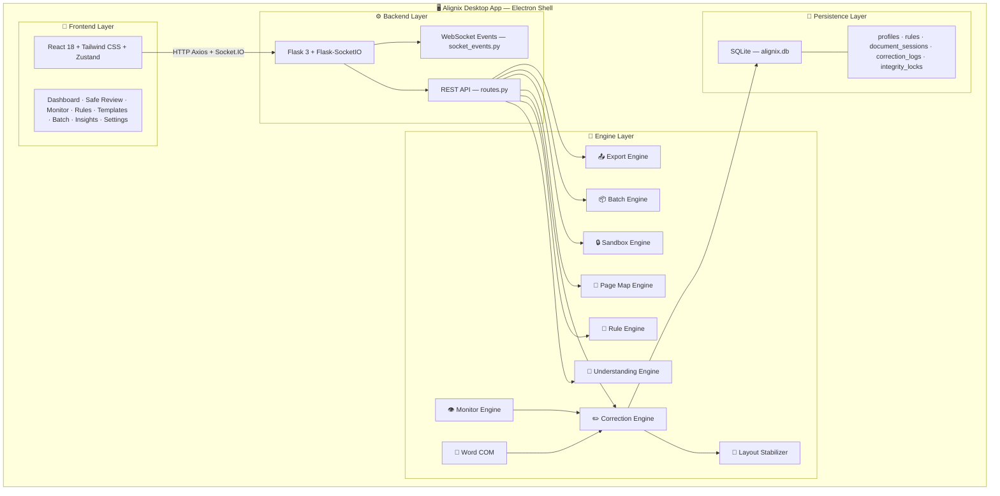

---

## 📁 Folder Structure

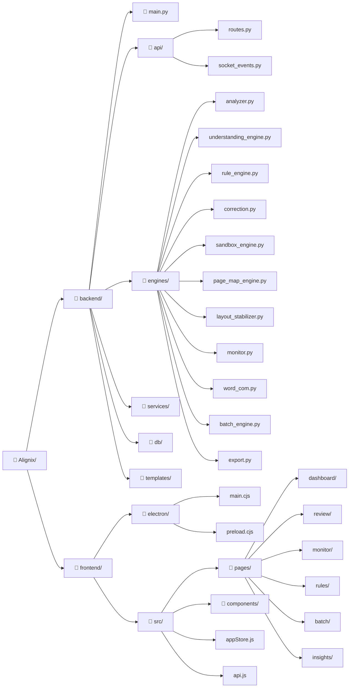

---

## 🔄 Safe Review Workflow

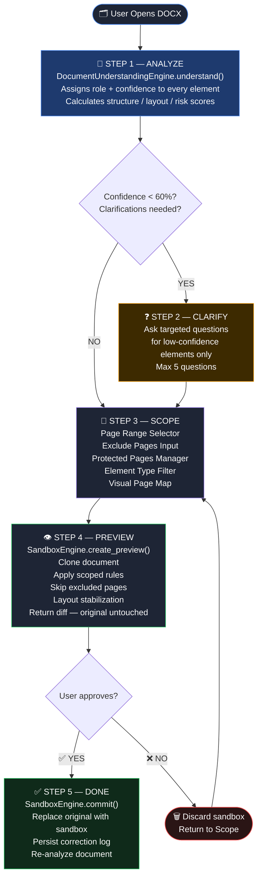

---

## 📄 Page-Scoped Correction Flow

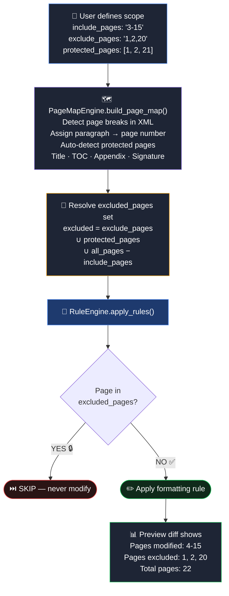

---

## 🧠 Document Understanding Engine

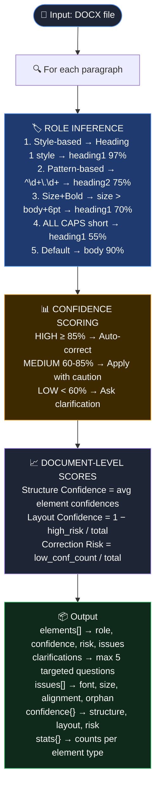

---

## 👁️ Live Monitoring Architecture

```mermaid
flowchart LR
    subgraph ModeA["📁 Mode A — File System Watchdog"]
        W1["watchdog.Observer\nwatches document directory"]
        W2["on_modified event"]
        W3["Debounce timer 1.5s"]
        W4["check_violations()"]
        W1 --> W2 --> W3 --> W4
    end

    subgraph ModeB["🔗 Mode B — Word COM pywin32"]
        C1["Poll Word.Application\nevery 2 seconds"]
        C2["doc.Saved transition\nFalse → True"]
        C3["User just saved"]
        C4["check_violations()"]
        C1 --> C2 --> C3 --> C4
    end

    W4 --> DEC{Violations\nfound?}
    C4 --> DEC

    DEC -->|YES| FIX["✏️ correct()\nauto-repair formatting"]
    DEC -->|NO| CLEAN["✅ emit monitor:clean"]

    FIX --> EMIT["📡 emit monitor:corrected\n{path, source, violations, changes}"]

    EMIT --> SOCK["🔌 Socket.IO → useSocket hook"]
    CLEAN --> SOCK

    SOCK --> STORE["🗃️ Zustand Store"]
    STORE --> UI["🔔 NotificationStack\n📋 Monitor Event Log"]

    style ModeA fill:#1e2535,stroke:#4f8ef7
    style ModeB fill:#1e2535,stroke:#a78bfa
    style FIX fill:#0f2a1a,stroke:#22c55e,color:#fff
    style CLEAN fill:#0f2a1a,stroke:#22c55e,color:#fff
```

---

## 🔁 Correction Engine & Rollback

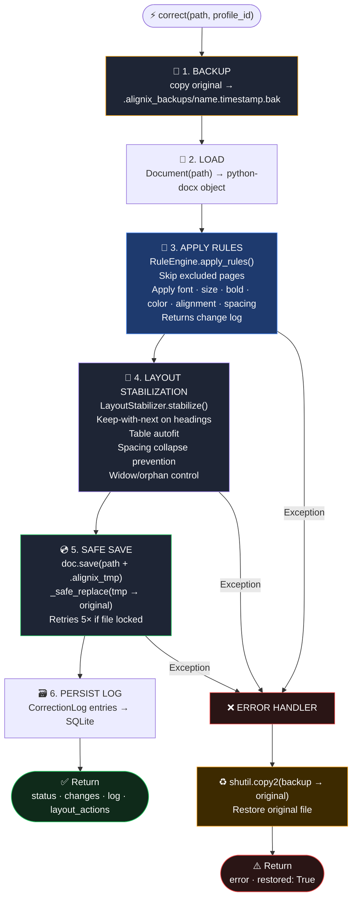

---

## 📦 Batch Automation Flow

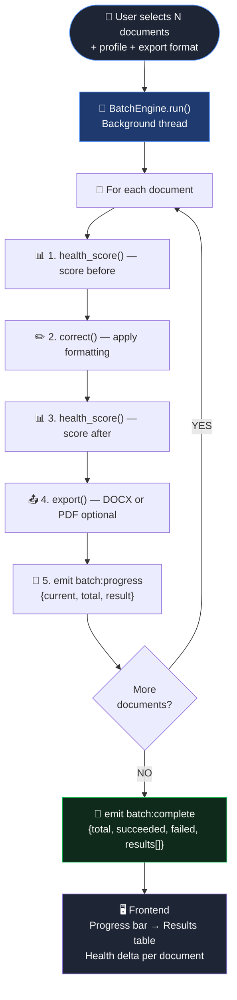

---

## 🗄️ Database Schema

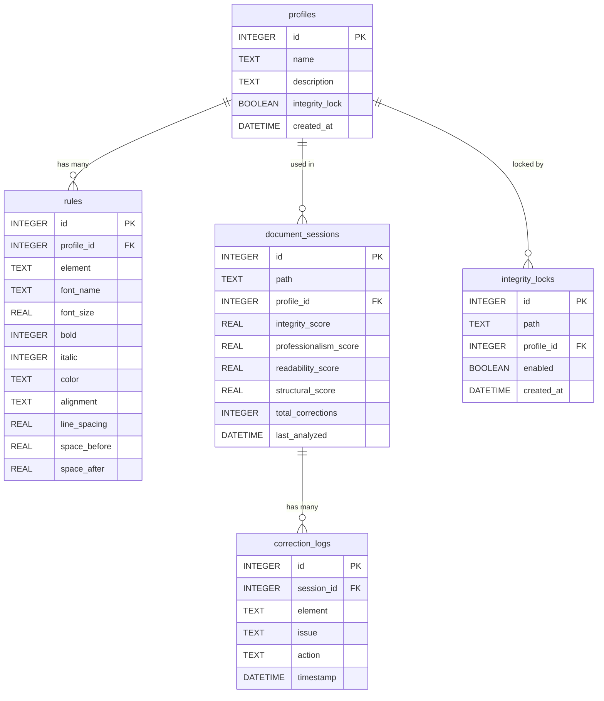

---

## 🌐 API Reference

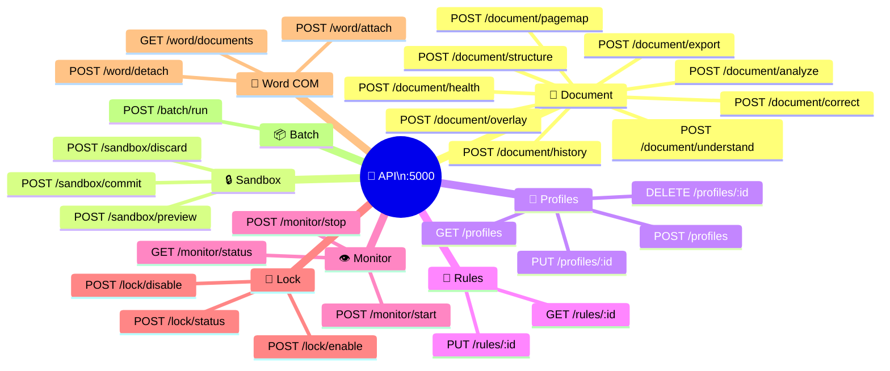

---

## 🗃️ Frontend State Architecture

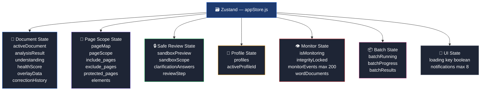

---

## 🔌 Electron IPC Bridge

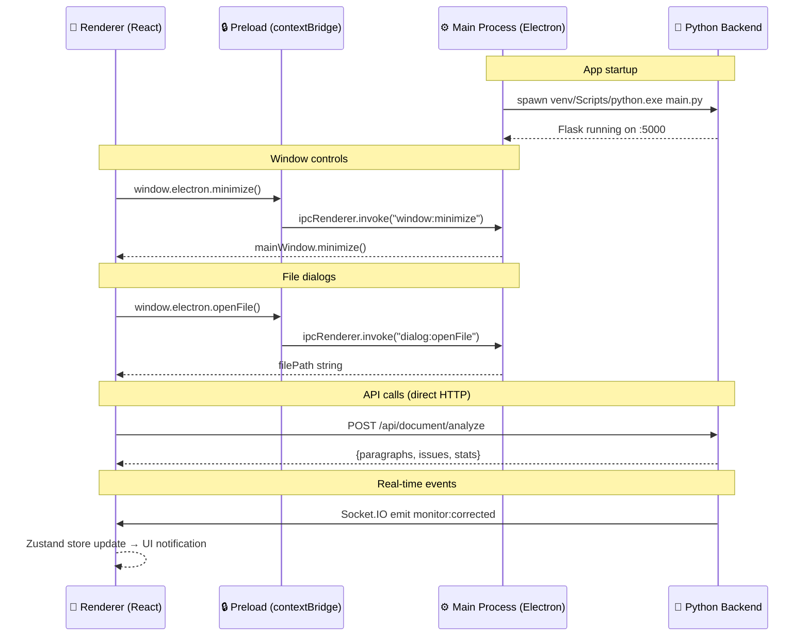

---

## 🎯 Confidence Scoring Reference

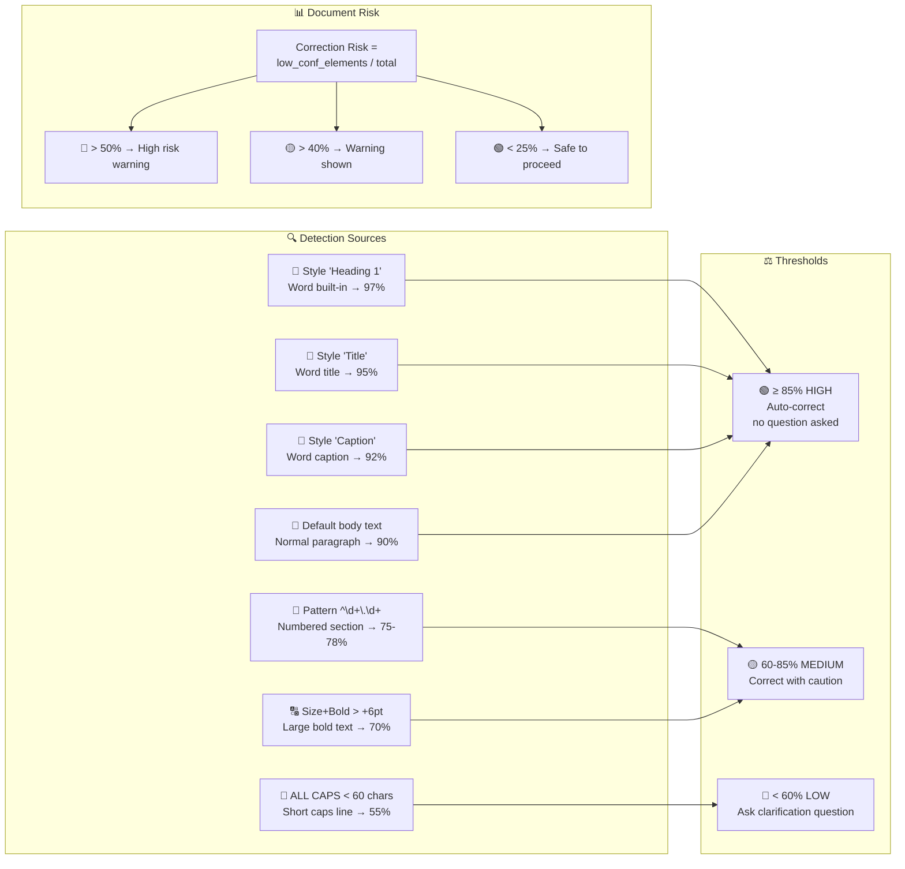

---

## 🛠️ Tech Stack

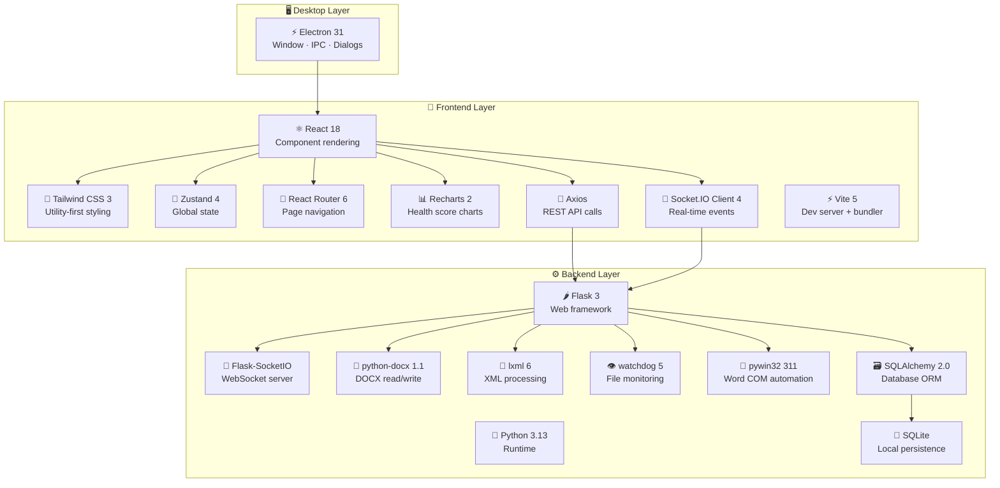

---

## 📋 Built-in Templates

| 📄 Template | 🔤 Font | 📏 Body | 📌 Heading 1 | ↕️ Spacing |
|---|---|---|---|---|
| 🔬 IEEE Paper | Times New Roman | 10pt | 14pt Bold | 1.0× |
| 🎓 College Report | Times New Roman | 12pt | 18pt Bold | 1.5× |
| 💼 Business Proposal | Calibri | 11pt | 20pt Bold | 1.15× |
| ⚖️ Legal Document | Times New Roman | 12pt | 14pt Bold | 2.0× |
| 📋 Resume | Calibri | 11pt | 16pt Bold | 1.15× |
| 🎓 Dissertation | Times New Roman | 12pt | 16pt Bold | 2.0× |

---

## 🔗 Core Workflow

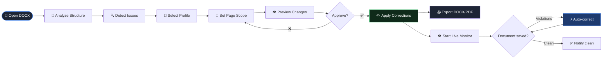

---

<div align="center">

**Built with ❤️ — Alignix © 2024**

*A self-maintaining professional document intelligence platform*

</div>
